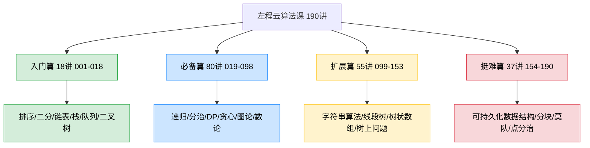
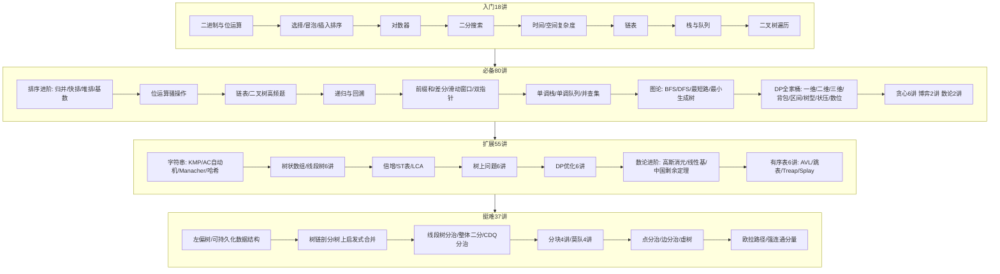
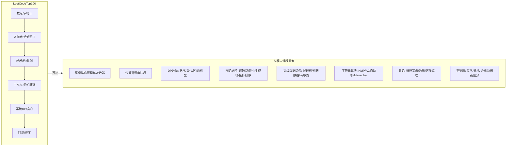
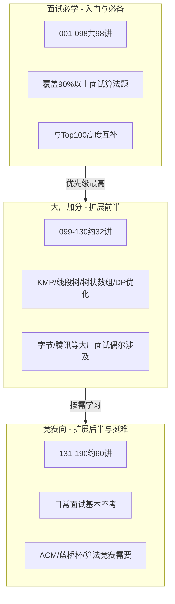
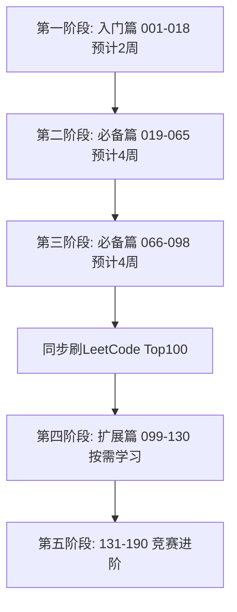

# 左程云算法课程质量与学习价值分析
## 一、课程基本信息
**课程来源：** 左程云（左神）B站免费算法课程
**课件数量：** 190 个 PPT/PDF 文件
**代码数量：** 190 个 class 目录、1252 个 Java 源文件
**对应关系：** 每个 PPT 对应一个 class 目录，目录内含该节课的所有题目代码
**课件缺失代码的章节：** class008（算法和数据结构简介）、class029（排序总结）、class088（DP专题总结）——均为总结性章节，无代码正常
## 二、课程结构概览

## 三、难度分级详解
### 3.1 四级难度分布
| 难度等级 | 讲次范围 | 讲数 | 占比 | 目标人群 |
|---------|---------|------|------|---------|
| 入门 | 001-018 | 18讲 | 9.5% | 零基础、转行选手 |
| 必备 | 019-098 | 80讲 | 42.1% | 面试准备、校招社招 |
| 扩展 | 099-153 | 55讲 | 28.9% | 进阶提升、大厂面试加分 |
| 挺难 | 154-190 | 37讲 | 19.5% | 竞赛选手、算法爱好者 |
### 3.2 各阶段知识点分布

## 四、代码质量分析
### 4.1 代码风格特点
| 维度 | 评价 | 说明 |
|------|------|------|
| 命名规范 | 偏竞赛风格 | 变量名简短如 `l`、`r`、`tR`、`dC`，竞赛常见，阅读需适应 |
| 注释质量 | 题目说明为主 | 每个文件顶部标注题意和OJ链接，算法逻辑内注释较少 |
| 代码结构 | 单文件单题 | 每道题一个 Java 文件，结构清晰，便于查找 |
| 对数器 | 早期课程有 | 入门阶段专门讲对数器，后期代码依赖OJ在线测试 |
| IO方式 | ACM模式 | 高级题目使用 `StreamTokenizer` + `PrintWriter`，面向OJ提交 |
| 解法版本 | 多版本对比 | 部分题目提供暴力解+优化解（如 Code01_xxx1.java 和 Code01_xxx2.java） |
### 4.2 代码质量评分
| 阶段 | 平均质量 | 特点 |
|------|---------|------|
| 入门篇 | 7.5/10 | 教学导向，有对数器演示，适合初学 |
| 必备篇 | 8/10 | 覆盖面广，LeetCode 题目为主，实用性强 |
| 扩展篇 | 8/10 | 数据结构实现完整，偏竞赛风格 |
| 挺难篇 | 8.5/10 | 高级算法实现难度大，代码精炼，迭代版避免爆栈 |
### 4.3 代码亮点
- **多解法对比：** 同一题提供暴力解和最优解（后缀1和2），便于理解优化过程
- **模板化实现：** 线段树、树状数组、并查集等提供可直接复用的代码模板
- **工程细节：** Java 大递归深度用迭代版替代，体现工程经验
- **OJ验证：** 每道题标注了 LeetCode/洛谷链接，可直接提交验证
## 五、与力扣 Top100 的互补性分析
### 5.1 覆盖对比

### 5.2 互补价值表
| 维度 | LeetCode Top100 | 左程云课程 | 互补价值 |
|------|----------------|-----------|---------|
| 题目来源 | LeetCode精选 | LeetCode + 洛谷 + 竞赛 | 题源更广 |
| 难度上限 | Medium为主 | 覆盖到ACM竞赛级 | 天花板更高 |
| 算法深度 | 基础应用为主 | 原理+推导+优化 | 理解更深 |
| DP专题 | 约10题 | 23讲系统覆盖所有DP类型 | 显著补充 |
| 图论 | BFS/DFS基础 | 最短路/最小生成树/拓扑/SCC | 全面补充 |
| 数据结构 | 基础结构为主 | 线段树/树状数组/有序表全系列 | 大幅补充 |
| 数论 | 几乎不涉及 | 质数/快速幂/容斥/中国剩余定理 | 完全补充 |
| 字符串 | 基础操作 | KMP/AC自动机/Manacher/哈希 | 完全补充 |
| 贪心 | 少量经典题 | 6讲专题系统训练 | 显著补充 |
### 5.3 面试价值分级

## 六、质量总评
### 6.1 优势
| 优势 | 说明 |
|------|------|
| 体系极其完整 | 190讲从零基础到ACM竞赛级，国内最完整的免费算法体系课 |
| 难度递进科学 | 四级标签（入门→必备→扩展→挺难），学习路径清晰 |
| DP讲解堪称业界标杆 | 23讲系统覆盖所有DP类型，从递归入手的教学方法通俗易懂 |
| 代码配套完整 | 1252个Java源文件，每道题可直接提交OJ验证 |
| 多版本解法 | 暴力解→优化解对比，帮助理解优化思路 |
| 实战导向 | 题目来自LeetCode/洛谷真题，非纯理论 |
### 6.2 不足
| 不足 | 说明 |
|------|------|
| 代码风格偏竞赛 | 变量名简短，静态变量较多，不适合直接用于工程项目 |
| 算法逻辑注释少 | 依赖视频讲解，纯看代码理解有一定难度 |
| 仅Java实现 | 没有Python/C++版本，其他语言使用者需自行翻译 |
| 部分高级内容日常用不到 | 挺难篇37讲偏竞赛，面试实用性低 |
### 6.3 综合评分
| 评分维度 | 得分 | 说明 |
|---------|------|------|
| 内容完整度 | 9.5/10 | 国内免费课中最完整的算法体系 |
| 教学质量 | 9/10 | 左神讲解清晰，递归入手DP的方法论优秀 |
| 代码质量 | 8/10 | 实现正确，风格偏竞赛 |
| 面试实用性 | 9/10 | 入门+必备98讲完全覆盖面试需求 |
| 性价比 | 10/10 | 完全免费，质量对标付费课程 |
| **综合评分** | **9/10** | **强烈推荐作为算法学习主线教材** |
## 七、学习建议
### 7.1 推荐学习路线

### 7.2 与 LeetCode Top100 的配合策略
| 策略 | 具体做法 |
|------|---------|
| 先左神后刷题 | 先看左神对应专题视频，理解原理后再刷 Top100 同类型题目 |
| 专题突破 | DP 看完 066-088 后集中刷 Top100 的 DP 题，效果最好 |
| 模板积累 | 左神课程中的线段树/树状数组/并查集模板可直接收藏复用 |
| 查漏补缺 | Top100 中不理解的题型，回左神课找对应专题系统学习 |
### 7.3 核心结论
> 左程云的算法课作为 LeetCode Top100 的**学习补充非常合适**。Top100 是"题目集"，适合练手和查漏；左神课程是"教材"，适合系统学习和建立方法论。两者结合使用效果最佳：**用左神课程学原理，用 Top100 练手感。**
**优先学习范围：** 入门+必备（001-098）共98讲，覆盖面试95%以上的算法知识点。
**选学范围：** 扩展前半（099-130），KMP、线段树等在大厂面试中偶尔出现。
**按兴趣学：** 扩展后半+挺难（131-190），适合有竞赛目标或纯粹的算法爱好者。
